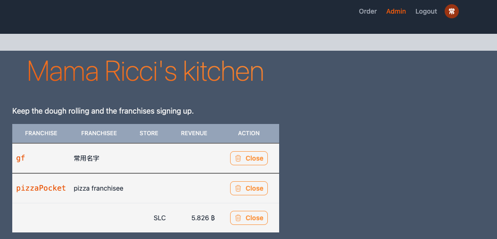
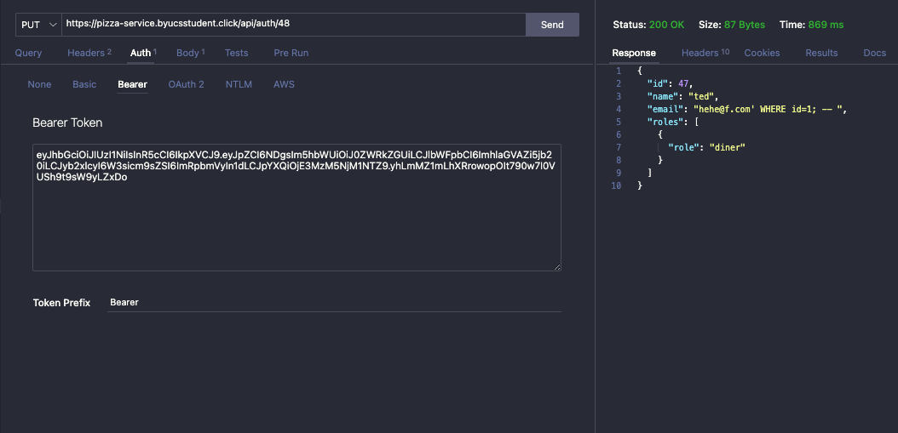

# Aaron Farr - penetration testing report

## Self attack

| Item           | Result                                               |
| -------------- | ---------------------------------------------------- |
| Date           | Dec 11, 2024                                         |
| Target         | pizza-service.trakkup.com                            |
| Classification | Injection                                            |
| Severity       | 2                                                    |
| Description    | SQL injection allowed admin account takeover.        |
| Images         |    Admin account acquired |
| Corrections    | Sanitize user inputs.                                |

## Peer attack

My assigned partner did not respond, so I completed this section on the BYU website by myself (as instructed by the TA)

For this attack I used the same technique that I had discovered for my self attack. I created a user, and then attempted to use the JWT to takeover the admin account. The API response showed
that the inputs had been sanitized properly, which resulted in a corruption of my account login and nothing more.

| Item           | Result                                                     |
| -------------- | ---------------------------------------------------------- |
| Date           | Dec 11, 2024                                               |
| Target         | pizza-service.byucsstudent.com                             |
| Classification | Injection                                                  |
| Severity       | 0                                                          |
| Description    | SQL injection was not possible on the updateUser endpoint. |
| Images         |    SQL injection sanitized      |
| Corrections    |                                                            |

## Summary of learnings

I learned that most SQL engines have systems in place to automatically sanitize SQL. I also learned that they usually only allow one command at a time. Had this not been the case, the bug I found earlier would have resulted in a complete takeover of the database, as I would have been able to execute any SQL command I wanted on the database.
